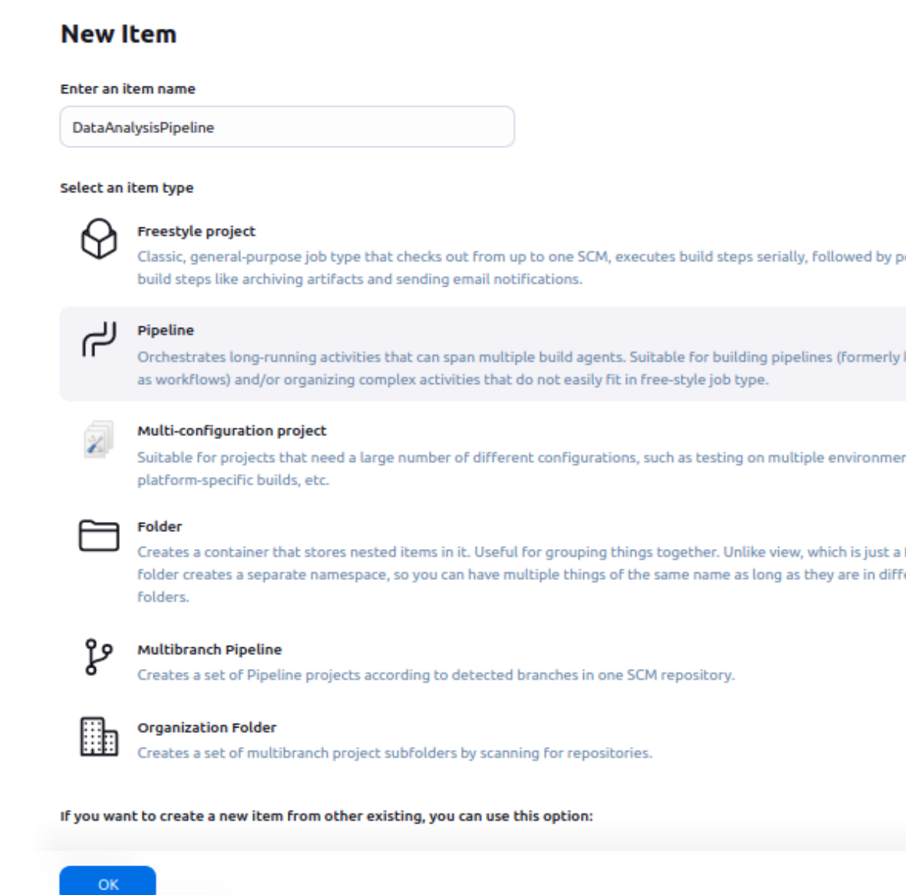
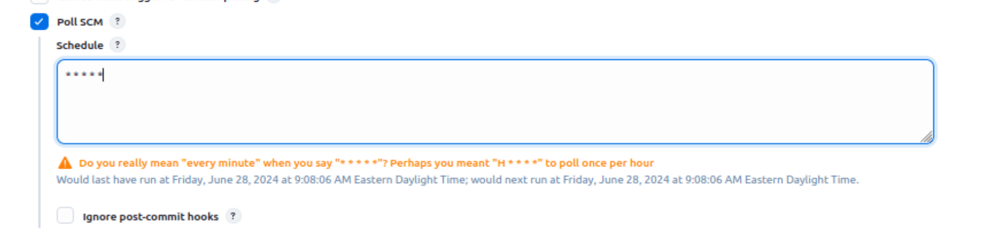
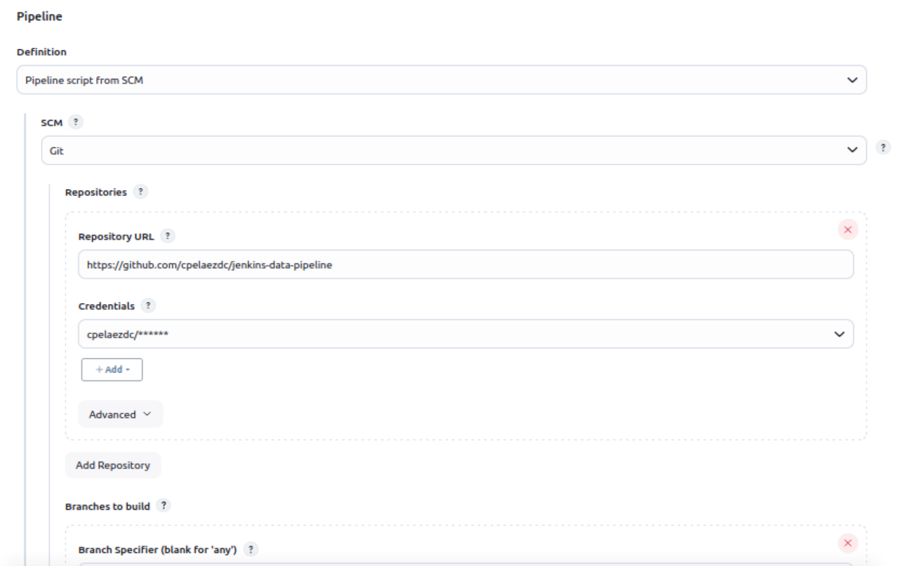
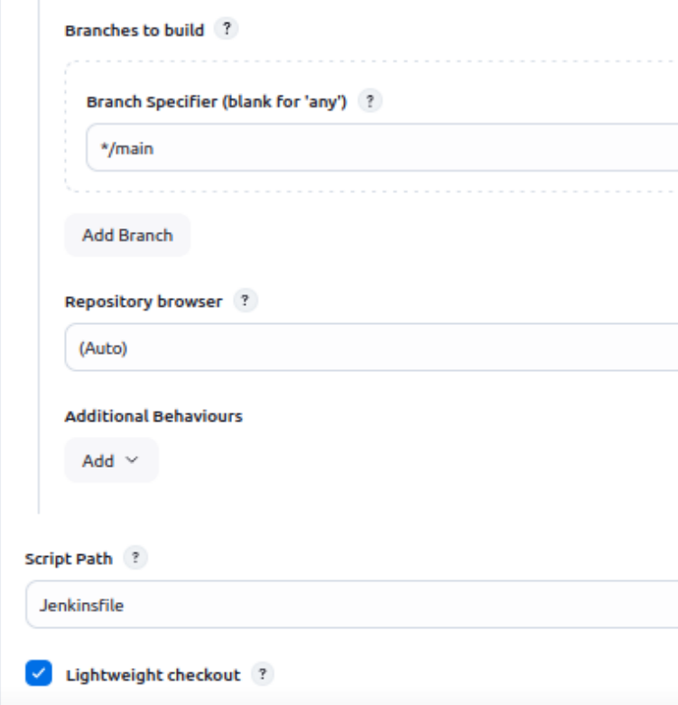
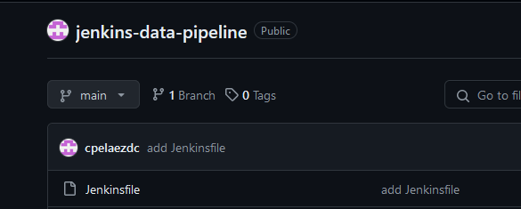
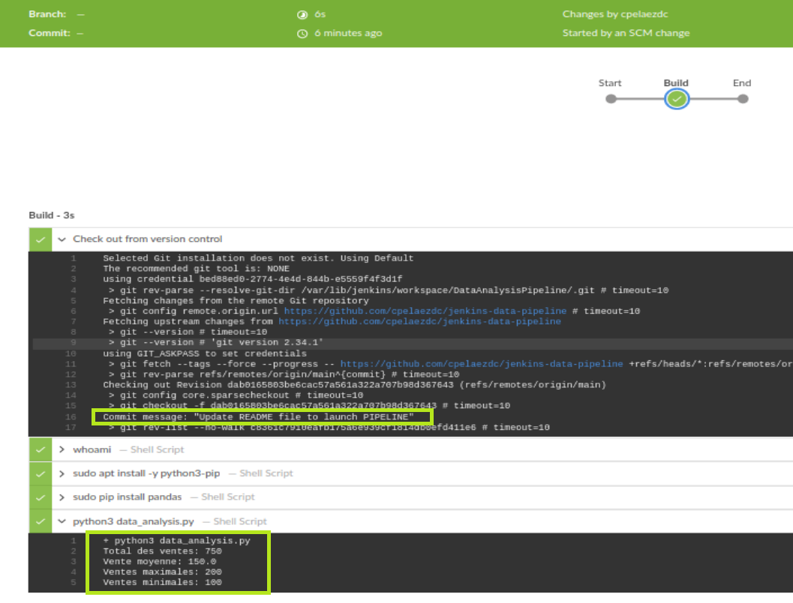
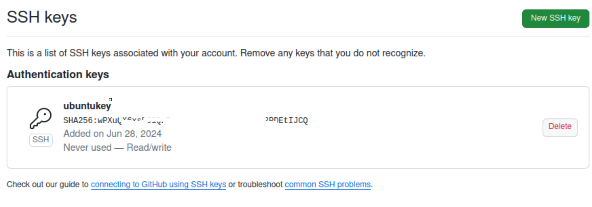
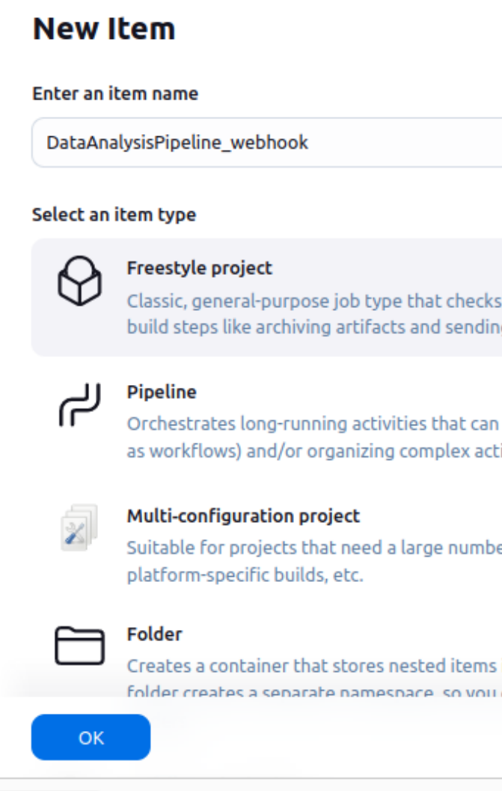

Examen mi-session-PARTIE3 - carlos

# Partie 1 : Préparation du Dépôt GitHub

1.  Create directory jenkins-data-pipeline and initialize git.

```bash
vboxuser@ubuntu2204-Jenkings:~/Documents$ mkdir jenkins-data-pipeline
vboxuser@ubuntu2204-Jenkings:~/Documents$ cd jenkins-data-pipeline/
vboxuser@ubuntu2204-Jenkings:~/Documents/jenkins-data-pipeline$ git init
Initialized empty Git repository in /home/vboxuser/Documents/jenkins-data-pipeline/.git/

```

2.  Create this current README.md file

```bash
vboxuser@ubuntu2204-Jenkings:~/Documents/jenkins-data-pipeline$ git status
On branch master

No commits yet

Untracked files:
  (use "git add <file>..." to include in what will be committed)
        README.md

nothing added to commit but untracked files present (use "git add" to track)
vboxuser@ubuntu2204-Jenkings:~/Documents/jenkins-data-pipeline$ git add .
vboxuser@ubuntu2204-Jenkings:~/Documents/jenkins-data-pipeline$ git commit -m "add README file"
```

3.  Create in github jenkins-data-pipeline repository and clone in local jenkins-data-pipeline


```bash
vboxuser@ubuntu2204-Jenkings:~/Documents/jenkins-data-pipeline$ git remote add origin https://github.com/cpelaezdc/jenkins-data-pipeline.git
vboxuser@ubuntu2204-Jenkings:~/Documents/jenkins-data-pipeline$ git branch -M main
vboxuser@ubuntu2204-Jenkings:~/Documents/jenkins-data-pipeline$ git push -u origin main
Username for 'https://github.com': cpelaezdc
Password for 'https://cpelaezdc@github.com':
Enumerating objects: 3, done.
Counting objects: 100% (3/3), done.
Writing objects: 100% (3/3), 268 bytes | 89.00 KiB/s, done.
Total 3 (delta 0), reused 0 (delta 0), pack-reused 0
To https://github.com/cpelaezdc/jenkins-data-pipeline.git
 * [new branch]      main -> main
Branch 'main' set up to track remote branch 'main' from 'origin'.
```

4.   Add others files to this project"

```bash
vboxuser@ubuntu2204-Jenkings:~/Documents/jenkins-data-pipeline$ nano data_analysis.py
vboxuser@ubuntu2204-Jenkings:~/Documents/jenkins-data-pipeline$ nano sales_data.csv
vboxuser@ubuntu2204-Jenkings:~/Documents/jenkins-data-pipeline$ git status
On branch main
Your branch is up to date with 'origin/main'.

Untracked files:
  (use "git add <file>..." to include in what will be committed)
        data_analysis.py
        sales_data.csv

nothing added to commit but untracked files present (use "git add" to track)
vboxuser@ubuntu2204-Jenkings:~/Documents/jenkins-data-pipeline$ git add .
vboxuser@ubuntu2204-Jenkings:~/Documents/jenkins-data-pipeline$ git commit -m "Initial commit with adv
anced data anlysis script"
vboxuser@ubuntu2204-Jenkings:~/Documents/jenkins-data-pipeline$ git push origin main
```


# Partie 2 : Configuration du Pipeline Jenkins

1.   Add a new job as pipeline









2.   Add a Jenkinsfile and push to GitHub




# Partie 3 : Testez Votre Configuration

-  Add sudo privileges to Jenkins user to execute pip install command and avoid ask me for password during the sudo execution command.

```bash
root@ubuntu2204-Jenkings:/etc/sudoers.d# touch jenkins-user-privileges
root@ubuntu2204-Jenkings:/etc/sudoers.d# nano jenkins-user-privileges
root@ubuntu2204-Jenkings:/etc/sudoers.d# cat jenkins-user-privileges
jenkins ALL=(ALL) NOPASSWD: ALL
```
-  Add only lecture privileges to jenkins user

```bash
root@ubuntu2204-Jenkings:/etc/sudoers.d# chmod 440 jenkins-user-privileges
root@ubuntu2204-Jenkings:/etc/sudoers.d# ls -l
total 8
-r--r----- 1 root root   32 Jun 28 10:28 jenkins-user-privileges
-r--r----- 1 root root 1096 Feb  8  2022 README
root@ubuntu2204-Jenkings:/etc/sudoers.d# visudo --check
/etc/sudoers: parsed OK
/etc/sudoers.d/README: parsed OK
/etc/sudoers.d/jenkins-user-privileges: parsed OK
root@ubuntu2204-Jenkings:/etc/sudoers.d#
```

-  The current update of this README file in GITHUB must lauch a build pipeline process:



# (BONUS) Configuration du Webhook GitHub pour Déclencher le Pipeline :

1.  Generate a SSH key in ubuntu (OS use for this project)

```sh
ssh-keygen -t ed25519 -C "cpelaezdc@gmail.com"
```

2.  Add ssh key in GITHUG



3.  Create a new job Freestyle




4.  In Jenkins Create credentials with this SSH key

test2223